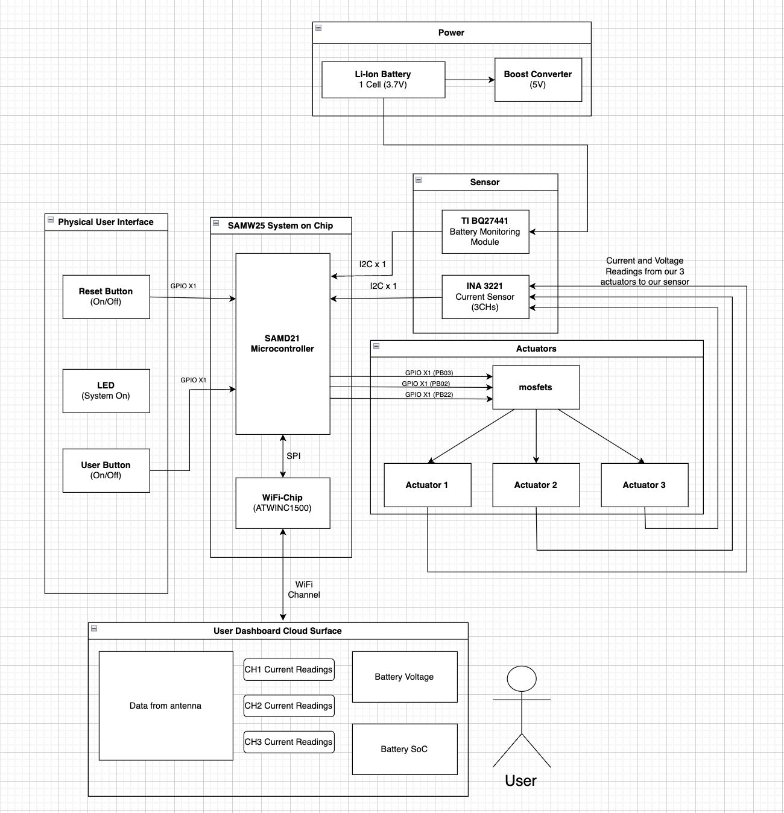

# a14g-final-submission

    * Team Number: 15
    * Team Name: Rocketman
    * Team Members: Surya Sandeep Akella & Dhruv Kushalkar
    * Github Repository URL:
    * Description of test hardware: (development boards, sensors, actuators, laptop + OS, etc)

## 1. Video Presentation

### Our youtube Video Link:

## 2. Project Summary

Rocketman is a IoT-based dynamic power load balancer designed for satellite communication microgrids. It uses a SAMW25 microcontroller, INA3221 current sensor, and BQ27441 fuel gauge to monitor real-time power metrics and dynamically manage three actuators—an antenna, LED, and DC fan—based on priority. The system ensures the highest-priority actuator (the antenna) remains continuously powered, while lower-priority devices are disabled as battery levels drop. With integrated Wi-Fi, Rocketman provides real-time monitoring and remote control via a web dashboard, offering an efficient, scalable solution for power-constrained ground stations.

### Device Description

Rocketman addresses this gap by introducing a dynamic power load balancer tailored for satellite communication microgrids. It ensures that critical actuators like antennas remain active by automatically prioritizing loads based on battery health, real-time power consumption, and system constraints. In this proof-of-concept implementation, the system is configured to always prioritize one actuator—the communication antenna—which remains powered continuously as long as sufficient battery charge is available. As the battery depletes, the system dynamically adjusts power distribution, disabling lower-priority loads such as LEDs and cooling fans to preserve energy for the antenna. By integrating smart sensing, wireless control, and embedded decision-making, Rocketman enables efficient power management, helps maintain uptime, and reduces operational overhead in resource-constrained environments.

### Inspiration

Satellite ground stations operating in remote or power-constrained environments face significant challenges in managing energy consumption effectively. Critical components like communication antennas must operate reliably, while secondary loads such as LEDs or cooling systems need to be intelligently managed to conserve battery life. Traditional systems are often static, lack real-time monitoring, and require manual intervention, which can lead to system inefficiencies, unnecessary energy expenditure, or complete communication failure during power shortages.

### Device Functionality

#### Design Overview:

The device is built around a SAMW25 microcontroller, which serves as the central controller for power monitoring, actuator control, and wireless communication. An INA3221 current sensor measures voltage and current across three independent channels, each connected to a separate actuator: a communication antenna, an LED, and a DC fan. To monitor battery status, a BQ27441 fuel gauge tracks voltage, remaining capacity, and estimated runtime, enabling informed and dynamic power management decisions. GPIO-controlled MOSFETs are used to switch actuators on or off based on real-time system conditions and predefined priority levels, with the antenna set as the highest-priority load to ensure continuous operation.

For remote monitoring and control, sensor data is published over MQTT and transmitted to a Node-RED dashboard hosted on an Azure Virtual Machine. This dashboard provides real-time insights into battery health, power consumption, and actuator status, allowing users to manually override or monitor the system from any location.

For hardware demonstration, we implemented the concept using three 5V DC fans connected to the INA3221’s three channels. Channel 1 was assigned the highest priority, and as the battery voltage dropped, the system automatically toggled Channels 2 and 3 off to conserve energy—ensuring Channel 1 continued receiving uninterrupted power.

#### Block Diagram:

### Challenges:

* **Incorrect Shunt Resistor Placement for Current Sensing:**

  During the PCB design phase, we initially placed the shunt resistors on the low-side (towards ground) of each actuator channel and configured the INA3221 to measure both bus and shunt voltage across them. However, we later discovered that the INA3221 is a high-side current sensing device, which requires the shunt resistor to be placed on the high side (between the power source and load). This misconfiguration rendered the initial PCB readings invalid. To resolve this, we  removed the soldered shunt resistors , accessed the test points, and used external wiring to connect the actuators on a breadboard, allowing us to restore correct current measurement for all three channels.
* **FreeRTOS Resource Management and Task Synchronization:**

  While integrating FreeRTOS for real-time task management, we encountered significant issues related to  stack and heap memory constraints . The initialization of the Wi-Fi communication task notably reduced the available heap space, causing instability in sensor initialization and actuator control tasks. To address this, we carefully restructured the system initialization sequence— first initializing I2C communication, then configuring the INA3221 and BQ27441 sensors . We also introduced mutexes and semaphores to ensure thread-safe access to shared resources and coordinated actuator toggling based on the battery’s state of charge (SoC) as reported by the fuel gauge.

### Prototype Learnings

**Lessons Learned:**

The development process emphasized the critical importance of  understanding sensor specifications during schematic design , particularly for components like the INA3221 that rely on high-side current sensing. Early detection of this mismatch could have prevented post-fabrication rework and streamlined the hardware validation process. Additionally, the challenges faced while implementing FreeRTOS in a memory-constrained embedded environment highlighted the value of careful  task sequencing and memory profiling . Real-time debugging and trace-based monitoring proved essential in stabilizing the system under dynamic load conditions.

**Improvements:**

Future iterations will incorporate the corrected shunt resistor placement directly in the PCB layout to support proper high-side sensing. We also plan to  reallocate memory resources more efficiently , potentially by separating network and sensor tasks or optimizing FreeRTOS configuration settings. Lastly, integrating on-board diagnostics and heap monitoring tools earlier in the development cycle would help catch resource bottlenecks during task execution and improve system robustness.

### Next Steps

To advance Rocketman beyond the proof-of-concept stage, future iterations will focus on integrating the corrected high-side current sensing directly into the PCB layout for a more compact and production-ready design. We also aim to enhance actuator control by incorporating PWM (Pulse Width Modulation) instead of simple ON/OFF GPIO toggling. This will enable  variable current delivery , allowing for fine-grained control such as adjusting fan speeds in response to battery conditions or thermal demands. Additionally, expanding the control logic to support dynamic priority reconfiguration will allow the system to adapt more flexibly in multi-actuator scenarios. Lastly, migrating to a fully soldered and enclosed hardware build will increase system robustness and make it deployment-ready for real-world satellite ground station environments.

### Open Source and Acknowledgements

Our project integrates several open-source components, with full respect for their licenses and proper attribution. The following resources were instrumental in developing our system drivers and communication interfaces:

* **Adafruit INA3221 Library:**

  We referred to the [Adafruit INA3221 Arduino Library](https://github.com/adafruit/Adafruit_INA3221) to understand register configurations and communication protocols required for interfacing the INA3221 current sensor with the SAMW25 microcontroller.
* **SparkFun BQ27441 Library:**

  The [SparkFun BQ27441 Arduino Library](https://github.com/sparkfun/SparkFun_BQ27441_Arduino_Library) served as a valuable reference for implementing the I2C communication and data parsing logic required to interact with the TI BQ27441 fuel gauge.

The development of **Rocketman** was supported by a number of tools and platforms that significantly contributed to our system integration, debugging, and monitoring efforts:

* **Node-RED:**

  Used to design and deploy the real-time monitoring dashboard, Node-RED enabled seamless flow-based communication between the device and the remote UI via MQTT.
* **Microsoft Azure Virtual Machine:**

  A cloud-hosted Azure VM was used to host the Node-RED environment, providing stable and remote access to our power management dashboard during testing and demonstration.
* **Microchip Studio:**

  The firmware for the SAMW25 microcontroller was developed using Microchip Studio, which provided a robust and well-integrated environment for embedded C development, debugging, and project compilation.

## 3. Hardware & Software Requirements

### Hardware Requirements

| ID     | Requirement                                                                                                      |
| ------ | ---------------------------------------------------------------------------------------------------------------- |
| HRS 01 | The project shall be based on a Microchip SAMW25 microcontroller with integrated Wi-Fi, running at ≥ 32 MHz.    |
| HRS 02 | A triple-channel current sensor (INA3221) shall monitor the current and voltage draw of each actuator over I²C. |
| HRS 03 | A fuel gauge (BQ27441) shall measure battery State of Charge (SoC) and estimate run time, interfaced via I²C.   |
| HRS 04 | Three actuators (Antenna, LED, DC fan) shall be powered through MOSFET drivers controlled by SAMW25 GPIOs.       |
| HRS 05 | The LED load shall operate at 3.3–5 V DC and support ON/OFF control for power demonstration.                    |
| HRS 06 | The DC fan shall operate at 3.3–5 V DC with a max current draw of 200 mA for cooling/load demonstration.        |
| HRS 07 | The system shall use a single-cell Li-ion battery (3.7 V nominal, 4.2 V max) to power all components.            |
| HRS 08 | A stable 3.3 V rail shall be maintained using a voltage regulator to power the SAMW25 and associated ICs.        |
| HRS 09 | I²C communication shall support speeds up to 400 kHz for timely data acquisition from sensors.                  |
| HRS 10 | Connectors/headers shall be provided for accessible I²C and power lines during development and testing.         |

### Software Requirements

| ID     | Requirement                                                                                                                            |
| ------ | -------------------------------------------------------------------------------------------------------------------------------------- |
| SRS 01 | The system shall operate under FreeRTOS with three independent tasks.                                                                  |
| SRS 02 | Current sensor data shall be read at a configurable interval (default: 1 second, ±100 ms) for each actuator.                          |
| SRS 03 | The battery fuel gauge shall be polled at least every 2 seconds (±200 ms) for SoC and runtime estimation.                             |
| SRS 04 | The Wi-Fi dashboard shall display: actuator current (mA), battery SoC (%), run time estimate (min), manual toggles, and system alerts. |
| SRS 05 | Manual override commands from the dashboard shall immediately control actuator states, bypassing automated logic.                      |
| SRS 06 | Actuator state transitions shall be non-blocking to prevent delays in time-sensitive sensor tasks.                                     |
| SRS 07 | The system shall trigger a dashboard alert if battery temperature exceeds 45°C to indicate thermal risks.                             |
| SRS 08 | The firmware shall support secure OTA (Over-the-Air) updates with safeguards against incomplete or corrupt updates.                    |

## 4. Project Photos & Screenshots

### Complete Project Showcase

### Standalone PCBA

#### Top View

#### Bottom View

#### Thermal Camera Image

#### Altium Board Design

##### 2D View

###### Ground Plane

###### Power Plane

##### Schematic

##### 3D View

#### Node-RED

##### NodeRED Backend

##### NodeRED Dashboard

## Codebase

* **Node-RED Dashboard**

  [http://48.217.67.9:1880/ui](http://48.217.67.9:1880/ui)

  Real-time monitoring and control interface for Rocketman.
* **A12G GitHub Repository**

  [Rocketman Final Project Repository](https://github.com/ese5160/final-project-t15-rocketman/blob/main/A12G_README.md)

  Contains source code, documentation, and README for setup and deployment.
* **Altium 365 PCBA Design**

  https://upenn-eselabs.365.altium.com/designs/EA1F541E-8D40-4AF7-8616-4EAEA6857B1D#design

  Access to the full schematic and layout design of the Rocketman hardware.

**Website Link:**